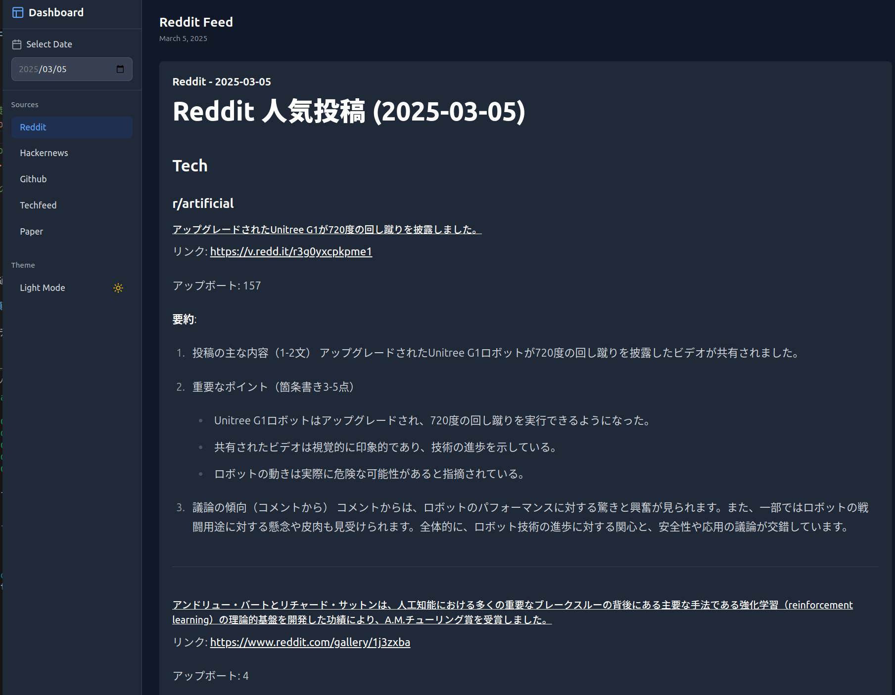
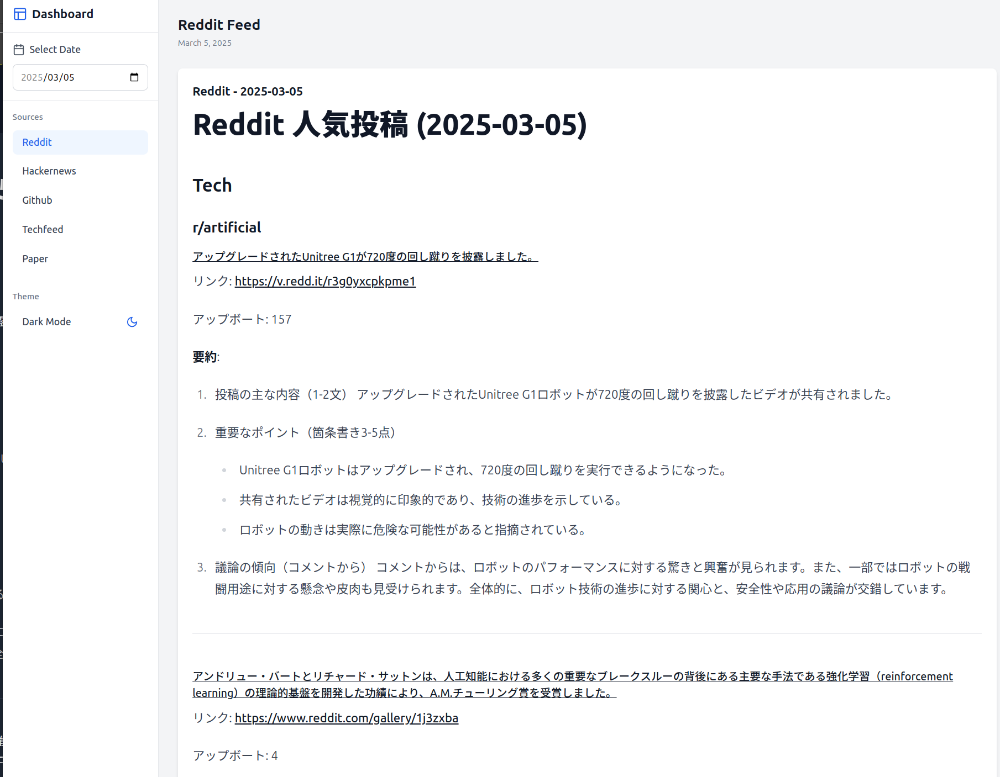

# Nook - パーソナル情報ハブ

Nookは、さまざまな情報ソース（Reddit、Hacker News、GitHub Trending、Tech Feed、arXiv論文）からコンテンツを収集し、一元的に表示するパーソナル情報ハブです。

Discus0434氏の[Nook](https://github.com/discus0434/nook)のフォークである、Tomatio13氏の[Nook](https://github.com/Tomatio13/nook)をベースとして、以下を変更しています。
- フロントエンド・バックエンドをそれぞれDockerコンテナ上で実行するように変更
- nginxを使用し、「https://localhost」でアクセスできるように変更
- 情報収集を毎日朝9時に実行するように、コンテナにcronを設定するように変更
- ローカルストレージの代わりにAWS S3を使用するように変更(サーバー自体はローカルで動かす想定です)
- Grokではなく、OpenAI APIを使用するように変更

*注意事項*
- Twitterへの投稿機能は実装していません。
- チャット機能は実装されていません。

## 画面イメージ
### ダークモード

### ライトモード


## 機能

- 複数の情報ソースからのコンテンツ収集と表示
  - Reddit人気投稿
  - Hacker News記事
  - GitHub Trendingリポジトリ
  - 技術ブログのRSSフィード
  - arXiv論文
- 日付ごとのコンテンツフィルタリング

## アーキテクチャ

Nookは以下のコンポーネントで構成されています：

1. **バックエンド（FastAPI）**
   - コンテンツAPI

2. **フロントエンド（React + Vite）**
   - サイドバー（ソース選択、日付選択、天気表示）
   - コンテンツビューア

3. **サービス**
   - Reddit Explorer：Redditの人気投稿を収集・要約
   - Hacker News Retriever：Hacker Newsの記事を収集
   - GitHub Trending：GitHubのトレンドリポジトリを収集
   - Tech Feed：技術ブログのRSSフィードを監視・収集・要約
   - Paper Summarizer：arXiv論文を収集・要約
   - AWS S3：収集したデータの保存
   - OpenAI APIクライアント：テキスト生成・要約

サービスの実行は、バックエンドのコンテナ内で定期的に実行されるようにしています。

## セットアップ

### 前提条件

以下のAPIキー：
- OpenAI APIキー（チャット・要約機能用）
- Reddit API認証情報（Reddit Explorer用）
- OpenWeatherMap APIキー（天気表示用）
- AWS S3のアクセスキーIDとシークレットアクセスキー

### インストール・実行

```bash
# リポジトリのクローン
git clone https://github.com/Tomatio13/nook.git
cd nook

cp backend/.env.example backend/.env

# .envファイルの環境変数を設定後、以下のコマンドを実行
docker compose up -d
```

### データの保存場所

収集されたデータは `data/` ディレクトリに保存されます：

```
(AWS S3のバケット名)/
├── nook/
│   ├── github_trending/     # GitHub Trendingデータ
│   ├── hacker_news/         # Hacker Newsデータ
│   ├── paper_summarizer/    # arXiv論文データ
│   ├── reddit_explorer/     # Redditデータ
│   └── tech_feed/           # 技術ブログフィードデータ
```

各サービスは日付ごとにファイルを作成します（例：`2023-04-15.md`）。

## 開発

### プロジェクト構造

```
nook/
├── backend/                # バックエンドのルートディレクトリ
│   ├── Dockerfile        # バックエンドのDockerfile
│   ├── start.sh         # コンテナ起動スクリプト
│   ├── requirements.txt   # Python依存関係
│   ├── .env.example      # バックエンド環境変数テンプレート
│   └── src/              # バックエンドソースコード
│       ├── api/          # FastAPI関連
│       │   ├── main.py   # FastAPIアプリケーション
│       │   ├── models/   # データモデル
│       │   └── routers/  # APIルーター
│       ├── common/       # 共通ユーティリティ
│       │   ├── s3_storage.py     # S3ストレージ
│       │   └── openai_client.py  # OpenAI API
│       └── services/     # 各種サービス
│           ├── github_trending/
│           ├── hacker_news/
│           ├── paper_summarizer/
│           ├── reddit_explorer/
│           └── tech_feed/
│
├── frontend/              # フロントエンドのルートディレクトリ
│   ├── Dockerfile        # フロントエンドのDockerfile
│   ├── package.json      # Node.js依存関係
│   ├── vite.config.ts    # Vite設定
│   ├── public/          # 静的ファイル
│   └── src/             # フロントエンドソースコード
│       ├── components/  # UIコンポーネント
│       ├── api/         # APIクライアント
│       └── styles/      # スタイルシート
│
├── nginx/                 # Nginxのルートディレクトリ
│   ├── Dockerfile        # NginxのDockerfile
│   └── nginx.conf        # Nginx設定ファイル
│
├── docker-compose.yml     # Docker Compose設定
├── .gitignore
├── LICENSE
└── README.md
```

## ライセンス

GNU AFFERO GENERAL PUBLIC LICENSE

## 謝辞
- [Nook](https://github.com/discus0434/nook)
- [FastAPI](https://fastapi.tiangolo.com/)
- [React](https://reactjs.org/)
- [Vite](https://vitejs.dev/)
- [OpenWeatherMap](https://openweathermap.org/)
- [Grok](https://grok.ai/)
- [Reddit API](https://www.reddit.com/dev/api/)
- [Hacker News API](https://github.com/HackerNews/API)
- [GitHub](https://github.com/)
- [arXiv](https://arxiv.org/)
